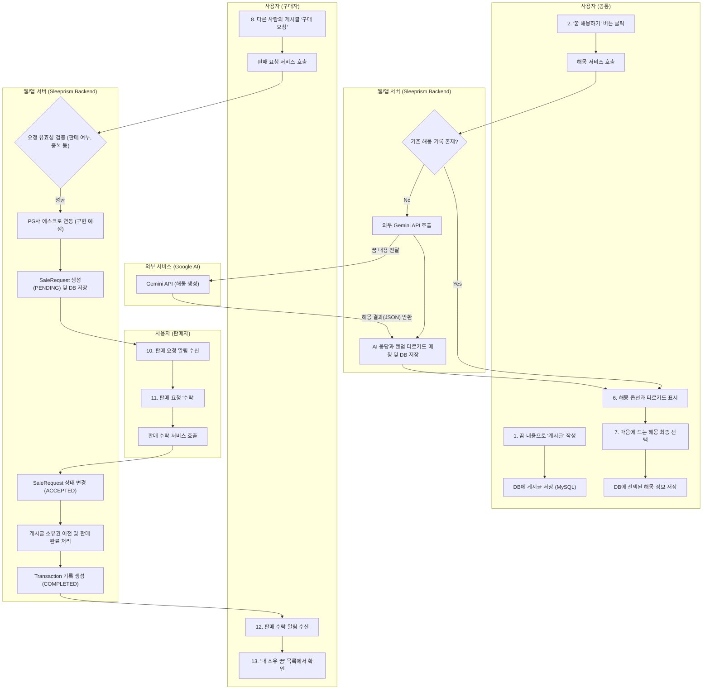
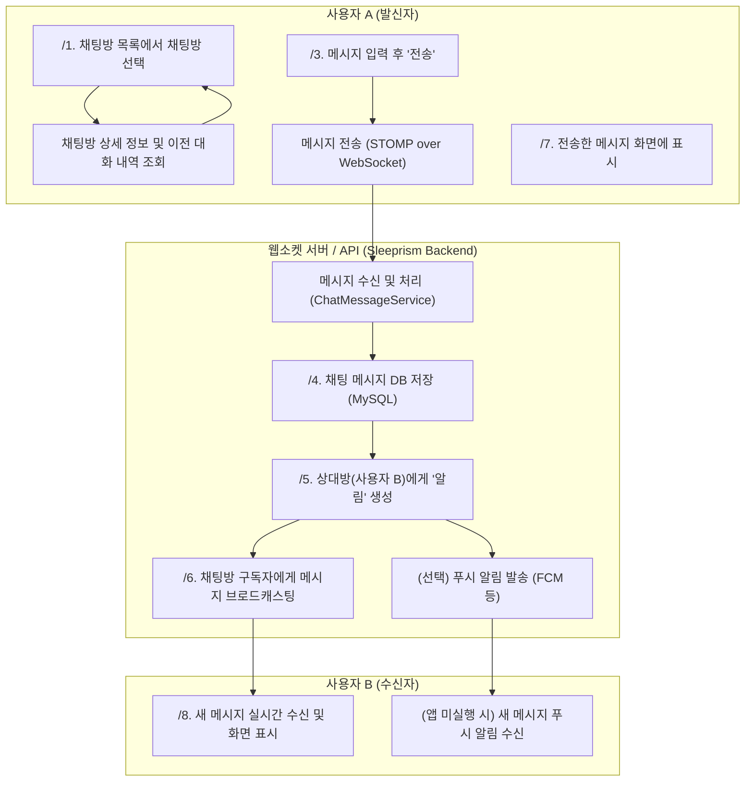

# 🌙 Sleeprism

> 꿈을 공유하고 해석하는 AI 기반 커뮤니티 서비스  

[배포 링크](https://h-like.github.io/sleeprism-frontend/) | [시연 영상](https://youtu.be/zpVfVakX74U) | [포트폴리오](https://example.com)

---

## 🧠 주요 기능

- ✍️ 꿈 입력 → AI 해몽
- 🃏 타로 카드 선택 기능
- 🗣 사용자 간 댓글 및 채팅
- 🔔 실시간 알림 기능

---

## 🛠 기술 스택
- Frontend: React, TypeScript
- Backend: Spring Boot, SpringSecurity, WebSocket
- Database: MySQL

---

## 꿈 해몽 flowchart

# 웹소켓을 이용한 채팅

